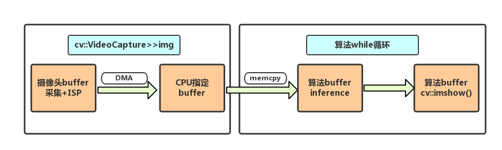

# GestureDetect based on OpenCV & Caffe
&nbsp;&nbsp;&nbsp;&nbsp;&nbsp;该项目是基于作者参加ARM在浙江大学举办的嵌入式算法大赛的赛题C手势识别整理而来。整套算法基于OpenCV和CaffeOnAcl实现,平台在ARM公司的Firefly3399（2×A72+4×A53）上定制的ubuntu16.04.比赛目标是在480p(640x480)的视频图像中最快检测出自定义的五种及以上的目标手势并准确分类。
 

### 环境需求
#
&nbsp;&nbsp;&nbsp;&nbsp;&nbsp;考虑到很多方面的原因，算法并没有做特别低层的优化，所以可移植性还是较高的。ubuntu系统下只要配置好以下的库，修改Makefile即可，并不限定平台。但如果你也是基于Firefly3399平台的用户，推荐参考如下链接&nbsp;[OAID/CaffeOnACL](https://github.com/OAID/CaffeOnACL/blob/master/acl_openailab/installation.md)&nbsp;安装opencv/caffe等其他依赖

- opencv-3.3.0
- CaffeOnACL/Caffe/Caffe2
- gflags

 

### 性能描述
#
- 题主选择的五项手势如下

&nbsp;&nbsp;&nbsp;&nbsp;&nbsp;hearta   &nbsp;&nbsp; heartb   &nbsp;&nbsp; greet  &nbsp;&nbsp;six   &nbsp;&nbsp;thumb

- 检测速度
&nbsp;&nbsp;&nbsp;&nbsp;&nbsp;关于检测速度，我们需要将整个问题的流程进行详细的分析。对于一帧测试图像整个过程大致分为如下流程图

&nbsp;&nbsp;&nbsp;&nbsp;&nbsp;其中摄像头负责采集并做ISP等功能的时间由摄像头规格决定（包括曝光时间，处理速度等等）,DMA时间由带宽决定,而由cpu拷贝至算法指定的buffer的时间由Opencv算法的实现和cpu性能决定。上述这一部分在比赛中限定使用cv::VideoCapture() >> img 实现。
&nbsp;&nbsp;&nbsp;&nbsp;&nbsp;实际上笔者关闭了整个算法循环的内容，可以测出cv::VideoCapture>>img的速度约为25fps,即该摄像头规格为480p25.实际在使用中，如果算法while循环一次的时间小于40ms，则需要继续等待下一帧img通过memcpy传输过来。当然笔者也进行了测试，在该平台上cv::imshow()一帧480p的图像平均时间在10~13ms之间。在这个情况下，会显示cap>>img的时间约为（40-13）=27ms左右。当然笔者进一步的测试总结如下表格：

<table width="85%" border="2" cellspacing="2" cellpadding="4" bgcolor="#CC99FF" bordercolor="#0000FF" align="center" >
<tr>
<td style="text-align:center">&nbsp;</td>
<td style="text-align:center">ISP+Capture</td>
<td style="text-align:center">memcpy</td>
<td style="text-align:center">cv::imshow</td>
<td style="text-align:center">inference</td>
</tr>
<tr>
<td style="text-align:center">time</td>
<td style="text-align:center">40ms</td>
<td style="text-align:center">12ms(uncertain)</td>
<td style="text-align:center">10~13ms</td>
<td style="text-align:center">3~5ms</td>
</tr>
</table>

&nbsp;&nbsp;&nbsp;&nbsp;&nbsp;&nbsp;到这里我们也就理清了cv::VideoCapture的工作原理（应该是算法线程会去开辟一个新的现成去完成左边框内的工作）。而算法线程每一帧图像在副线程完成DMA之后，就会拷贝给算法开辟的buffer中去，这个间隔是40ms。也就是说如果memcpy+inference+cv::imshow()的时间小于40ms，这个时候在算法线程就会挂起等待DMA结束。

欢迎留言或者邮件交流694790961@qq.com

			
			
